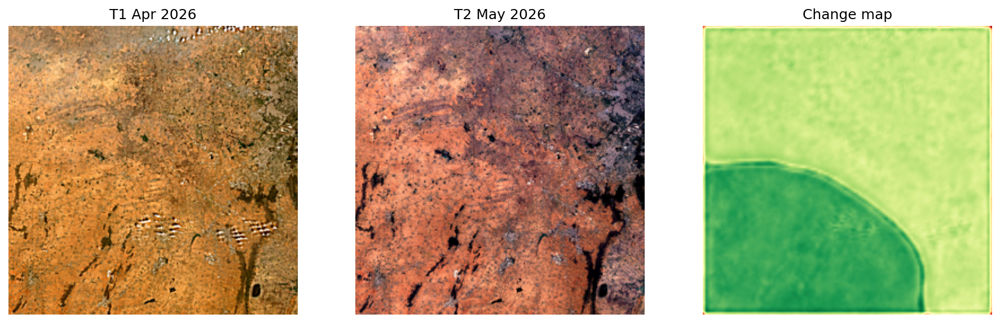
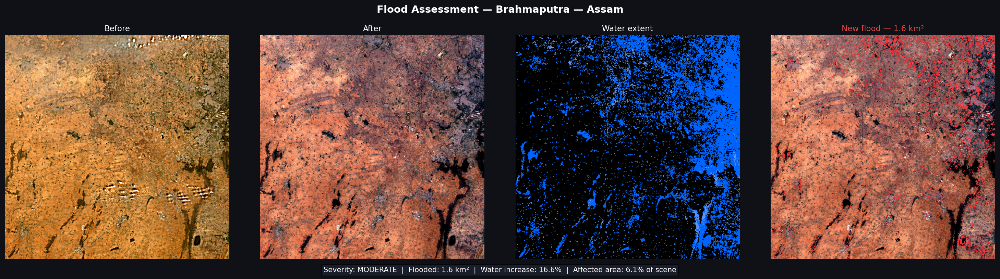

# 🛰️ Satellite Imagery Change Detection
A deep learning system for detecting land cover changes from satellite imagery, powered by a Siamese ResNet-50 architecture and live Sentinel-2 data from the ESA Copernicus API.

🔗 **Live Demo:** [shruti-satellite-detection.streamlit.app](https://shruti-satellite-detection.streamlit.app)

---

## 📌 Overview
This project addresses the problem of automatically detecting meaningful changes between two satellite images of the same location taken at different times. Unlike traditional pixel-differencing methods, this model learns deep feature representations — making it robust to lighting variation, seasonal shifts, and sensor noise.

---

## 📊 Results

| Metric | Score |
|--------|-------|
| F1 Score | **0.840** |
| IoU | **0.725** |
| Improvement over pixel-differencing baseline | **+64%** |

Benchmarked on the **LEVIR-CD** dataset — a standard remote sensing change detection benchmark.

---

## 🧠 Model Architecture
- **Siamese ResNet-50** — dual-branch network that takes two co-registered satellite images (T1 and T2) as input
- Each branch shares weights and extracts deep feature maps independently
- Feature difference is computed and passed through a decoder to produce a binary change mask
- Trained with a combination of Binary Cross-Entropy and Dice Loss for handling class imbalance

---

## 🌍 Real-World Data Pipeline
- Pulls live **Sentinel-2** imagery via the **ESA Copernicus API**
- Processes multispectral bands using **Rasterio** and **GDAL**
- Outputs change maps as **GeoJSON** overlays visualized with **Folium**
- Deployed as an interactive **Streamlit** web application

---

## 🛠️ Tech Stack

| Category | Tools |
|----------|-------|
| Deep Learning | PyTorch, ResNet-50 |
| Geospatial | Rasterio, GDAL, Albumentations, Folium |
| Satellite Data | ESA Copernicus API, Sentinel-2 |
| Output Format | GeoJSON |
| Deployment | Streamlit |
| Utilities | NumPy, Matplotlib, Google Colab |

---

## 🗂️ Dataset
- **LEVIR-CD** — Large-scale Remote Sensing Change Detection dataset
- Contains bi-temporal high-resolution Google Earth images
- Binary labels: changed / unchanged pixels

---

## 🚀 Getting Started

```bash
# Clone the repository
git clone https://github.com/Shruti1128/satellite-imagery-change-detection.git
cd satellite-imagery-change-detection

# Install dependencies
pip install -r requirements.txt

# Run the Streamlit app
streamlit run app.py
```

---

## 📁 Project Structure

```
├── app/
│   └── streamlit_app.py        # Streamlit application
├── src/
│   ├── model.py                # Siamese ResNet-50 architecture
│   ├── dataset.py              # Dataset loading and preprocessing
│   ├── sentinel.py             # ESA Copernicus API integration
│   ├── inference.py            # Inference pipeline
│   ├── flood_monitor.py        # Flood monitoring utilities
│   └── flood_alert.py          # Alert system
├── models/
│   └── best_model.pth          # Trained model weights
├── notebooks/                  # Experiment notebooks
├── outputs/                    # Model outputs
├── assets/                     # Sample result images
├── train.py                    # Training script
├── run_inference.py            # Run inference script
├── requirements.txt
└── README.md
```

---

## 📸 Sample Output





---

## 👩‍💻 Author

**Shruti Jha**
B.Tech in Computer Science (AI & ML) — Sikkim Manipal Institute of Technology

[](https://github.com/Shruti1128)

---

## 📄 License

This project is open source and available under the [MIT License](LICENSE).
